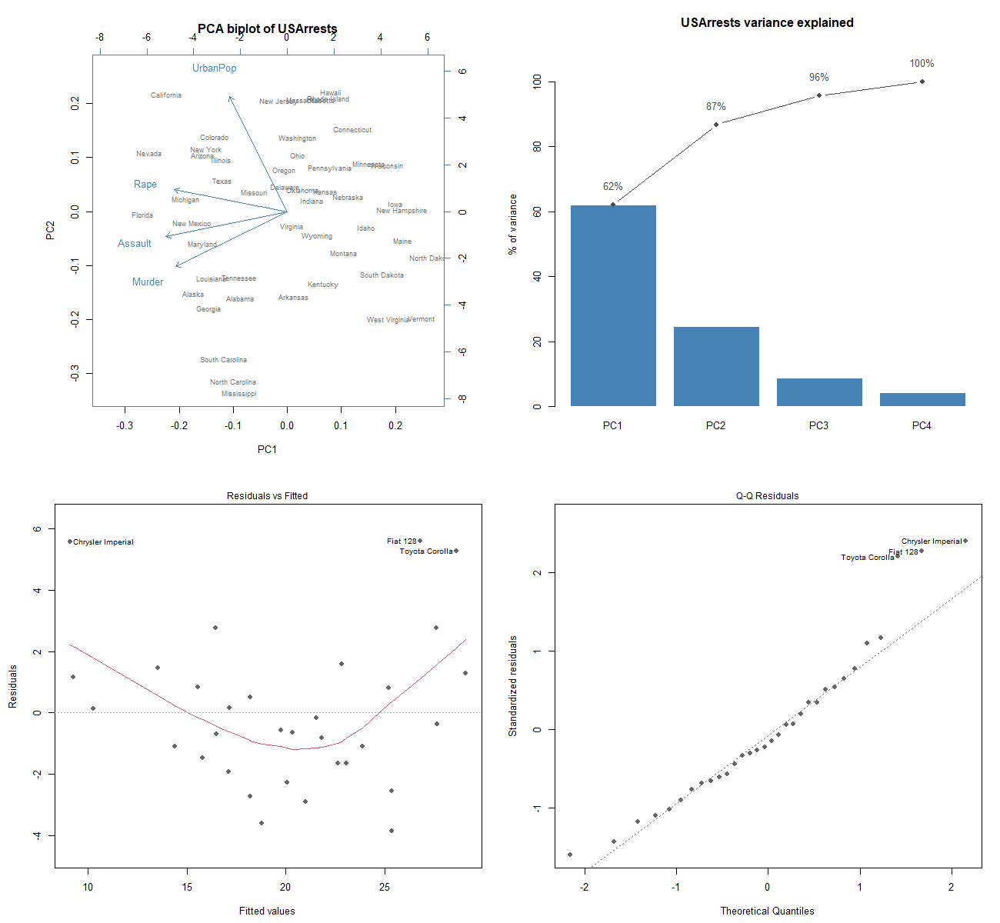

# statistical-methods-in-r

*Origin: Originally developed for the Data Science Methodology course at KAIST (Spring 2022); refactored and open-sourced in July 2026.*

A method-by-method tour of classical statistics, written entirely in base R.
Hypothesis tests, analysis of variance, regression, principal component and
factor analysis, and association-rule mining implemented from scratch, each
with its own experiment script, its own figure, and a number you can
reproduce bit for bit. There are no package installs and no downloads: every
dataset is either committed under `data/` or ships with R itself, and the
only random component (the market-basket generator) is pinned to `set.seed(1)`.



The panel above is regenerated by the run command below, along with every
other figure and the full [results/RESULTS.md](results/RESULTS.md).

## Run it

Base R 4.x is the only requirement, no external packages.

```bash
Rscript scripts/run_all.R      # every method, every figure, results/RESULTS.md
Rscript tests/test_basics.R    # 16 stopifnot-style checks
```

Each method also runs standalone, for example `Rscript scripts/02_anova.R`.
All numbers below were produced by these commands in this repository with
R 4.6.1.

## The methods

### 1. Hypothesis tests

Before comparing groups, check the distributional assumption. The
Shapiro-Wilk statistic W measures how well the ordered sample agrees with the
corresponding normal quantiles; values near 1 are consistent with normality.
On the guinea pig tooth-growth lengths, W = 0.967 with p = 0.109, so
normality is not rejected and a t-test is defensible.

The Welch two-sample t-test then compares mean tooth length across the two
delivery methods without assuming equal variances, using the
Satterthwaite-approximated degrees of freedom. Result: t = 1.92, df = 55.3,
p = 0.061, an estimated mean difference of 3.70 in favour of orange juice
that does not quite clear the 0.05 line. Pooling over dose hides most of the
story, which is exactly why the ANOVA section follows.

For two categorical variables, the chi-square test of independence compares
observed cell counts against the products of the margins. Gear count and
cylinder count in the mtcars data are clearly associated: X2 = 18.04, df = 4,
p = 0.0012.

Code: [`R/hypothesis_tests.R`](R/hypothesis_tests.R), driver
[`scripts/01_hypothesis_tests.R`](scripts/01_hypothesis_tests.R), figure
`results/hypothesis_tests.png`.

### 2. Analysis of variance

ANOVA partitions total variation into between-group and within-group parts
and compares them through the ratio F = MS_between / MS_within, which is F
distributed under the null of equal means. One way, tooth length on dose:
F = 67.4, p = 9.5e-16.

The two-way model `len ~ supp * dose` separates three questions at once, and
the answer to each is different, which is the pedagogical point of the
dataset:

| Term | F | p |
|------|----:|----:|
| supp (delivery method) | 15.6 | 2.3e-04 |
| dose | 92.0 | 4.0e-18 |
| supp x dose interaction | 4.1 | 0.022 |

The delivery-method effect that looked marginal in the pooled t-test is
strongly significant once dose is controlled for, and the significant
interaction says the OJ advantage shrinks at the highest dose. The
interaction plot in `results/anova_effects.png` shows the two mean profiles
converging at 2 mg/day.

Code: [`R/anova.R`](R/anova.R), driver [`scripts/02_anova.R`](scripts/02_anova.R).

### 3. Regression

Ordinary least squares minimizes the residual sum of squares; R-squared
reports the fraction of response variance the fitted plane explains. For
`mpg ~ wt + hp + qsec` on the 32 mtcars rows: R^2 = 0.835, adjusted
R^2 = 0.817, residual SE = 2.58 mpg. Weight dominates, at about -4.36 mpg
per 1000 lb holding the other two fixed. The residual diagnostics (residuals
vs fitted, normal Q-Q, scale-location) are drawn with base `plot.lm` into
`results/regression_diagnostics.png`; the smoother shows the mild curvature
you would expect from fitting a linear surface to a fuel-economy response.

Logistic regression models log-odds as a linear function and is fit by
maximum likelihood. Predicting manual transmission from weight and
horsepower gives in-sample accuracy 0.938 at a 0.5 threshold, with deviance
dropping from 43.2 (null) to 10.1. The fitted sigmoid at median horsepower,
plotted in the same figure, shows the sharp weight cutoff near 2900 lb. With
n = 32 this is a demonstration of the method, not a validated classifier,
and the accuracy is in-sample by design.

Code: [`R/regression.R`](R/regression.R), driver
[`scripts/03_regression.R`](scripts/03_regression.R).

### 4. PCA and factor analysis

Principal components are the eigenvectors of the correlation matrix, ordered
by the variance they carry. On the scaled USArrests data (50 states, 4
crime-rate variables), PC1 carries 62.0 percent and PC2 another 24.7
percent, so a 2-D biplot preserves 86.8 percent of the variance. In the
biplot (the hero figure above), the three violent-crime loadings point
together while urban population is nearly orthogonal: the data separate into
a crime axis and an urbanization axis.

Factor analysis inverts the viewpoint: it models observed correlations as
arising from a small number of latent factors plus variable-specific noise,
fit here by maximum likelihood with a varimax rotation. Six mtcars variables
resolve cleanly into a size/power factor (wt 0.97, disp 0.86, mpg -0.84)
and an acceleration factor dominated by quarter-mile time (qsec 0.96).

Code: [`R/pca_factor.R`](R/pca_factor.R), driver
[`scripts/04_pca_factor.R`](scripts/04_pca_factor.R), figure
`results/pca_biplot.png`.

### 5. Association rules, from scratch

For a rule A -> B over a set of transactions, support is P(A and B),
confidence is P(B | A), and lift is confidence divided by P(B), so lift
above 1 means A genuinely raises the probability of B. Packages like
`arules` implement this; here the counting, thresholding, and ranking are
about 40 lines of base R in [`R/association_rules.R`](R/association_rules.R).

The committed transaction set (400 baskets, seed 1) is generated with known
dependencies planted, which turns the miner into its own test: if the
implementation is right, the planted rules must surface with the top lift.
They do.

| Rule | Support | Confidence | Lift |
|------|--------:|-----------:|-----:|
| diapers -> beer | 0.275 | 0.846 | 3.08 |
| cola -> chips | 0.268 | 0.677 | 2.53 |
| eggs -> milk | 0.300 | 1.000 | 1.91 |
| butter -> bread | 0.440 | 1.000 | 1.69 |

Driver [`scripts/05_association_rules.R`](scripts/05_association_rules.R),
figure `results/rules_lift.png`.

## Data and reproducibility

The CSVs under `data/` are exact copies of base-R datasets (mtcars,
ToothGrowth, USArrests) plus the seed-1 synthetic transactions, exported by
[`scripts/make_sample_data.R`](scripts/make_sample_data.R) and verified
against the built-ins by the test suite. `load_datasets()` reads the CSVs
when present and falls back to the built-ins otherwise, both paths give
identical numbers. Details in [data/README.md](data/README.md). There is
nothing to download; `scripts/download_data.R` documents that.

No external packages are required, which is deliberate: everything here,
including the rule miner and all graphics, runs on a plain R installation.
If you prefer locked-down environments, `renv::init()` will happily snapshot
the (empty) dependency set, but it buys nothing for this project.

## Scope

The datasets are small classics chosen so every method's behaviour can be
verified by eye and rerun in seconds. This repository demonstrates correct
method choice, implementation, and diagnostics; it does not attempt large
data, cross-validated predictive modelling, or the full Apriori algorithm
for arbitrary-length itemsets (rules here are two-item by design).

## Layout and checks

```
R/            method implementations (utils, hypothesis_tests, anova,
              regression, pca_factor, association_rules)
scripts/      01-05 one experiment script per method, run_all.R to drive
              them all, make_sample_data.R, download_data.R (data note)
data/         committed sample CSVs, see data/README.md
results/      all figures plus the generated RESULTS.md
tests/        test_basics.R, 16 base-R checks run by CI on every push
```

CI (GitHub Actions, r-lib/actions) regenerates the sample data, runs the
test suite, and executes the full experiment suite on every push.

## License

MIT, see [LICENSE](LICENSE).

## Author

Aamir Malik. [GitHub](https://github.com/aamirmalik-dr) ·
[LinkedIn](https://linkedin.com/in/dr-aamirmalik)
